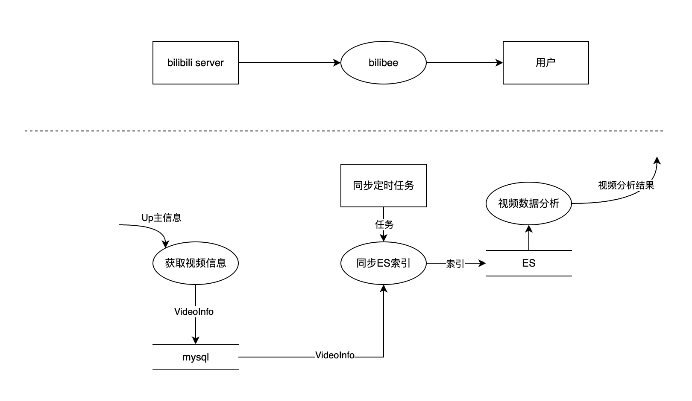
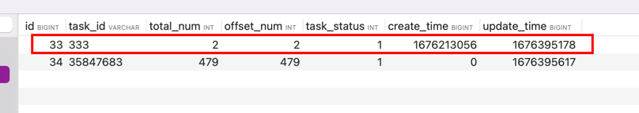
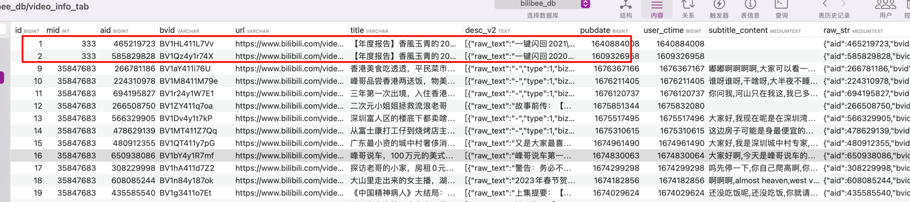

# bilibee
 哔哩哔哩（Bilibili B站）字幕分析工具

## 介绍
打算先做成只可以获取B站指定UP主的视频信息，包括字幕，然后将其同步到ES中，使用ES进行数据分析，NLP等。

## 数据流图
大致思路



## 如何启动？

### 安装golang
> go >= 1.18

### 启动Mysql
```bash
mysql.server start
```

### 创建表结构
> sql的内容位于deploy/sqls/db.sql中，可以使用客户端工具执行。

### 配置环境变量
```bash
export DB_USERNAME=YOUR_USERNAME -- 数据库用户名
export DB_PASSWORD=YOUR_PWD -- 数据库密码
export DB_NAME=YOUR_DB_NAME -- 数据库名称
export ES_ADDRESS_LIST=YOUR_ES_ADDRESS_LIST -- es地址 用逗号分隔
export DedeUserID=YOUR_DedeUserID -- B站cookie中的DedeUserID
export SESSDATA=YOUR_SESSDATA -- B站cookie中的SESSDATA
export BiliJCT=YOUR_BiliJCT -- B站cookie中的BiliJCT
export DedeUserIDCkMd5=YOUR_DedeUserIDCkMd5 -- B站cookie中的DedeUserIDCkMd5
```

> 如何获取B站cookie中的DedeUserID、SESSDATA、BiliJCT、DedeUserIDCkMd5？
1. 登录B站
2. 打开开发者工具，找到Network选项卡
3. 找到任意一个请求，找到Request Headers中的cookie，复制即可

> 为什么需要这些cookie？

因为B站的视频信息中的字幕是需要登录后才能获取的，所以需要这些cookie来模拟登录。

### 生成wire_gen.go（go依赖注入）
```bash
bash wire_gen.sh
```

### 启动http服务
```bash
go run ./cmd/collect_server
```
对应的http服务会监听8080端口

### 创建一条cron task
```bash
curl --location --request POST '127.0.0.1:8080/api/cron_task/create' \
--header 'Content-Type: application/json' \
--data-raw '{
    "mid": 333
}'
```
目前http服务还没有做前端页面，待开发，创建完成后会在数据库cron_task_tab看到记录


### 启动获取视频信息的定时任务
```bash
go run ./cmd/video_task
```
执行的过程中，相应的日志位于`log/data.log`中，可以观察对应的处理过程，正常处理完成后，task_status会置为1，表示完成。
此时，可以看到video_info_tab中记录video info信息：



### 

## 进展
- 2023.02.04 封装了获取b站视频信息的接口。
- 2023.02.15 完成获取视频信息服务的开发 && 自测。
- 2023.11.09 完成同步视频信息到ES的开发 && 自测。
